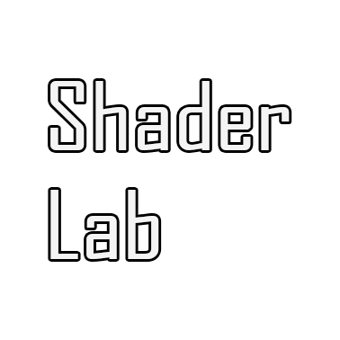

# 
PrazaVasNormandy

### 
_keelah se'lai_

##### `Mail Link` :  

---

  
###  Tech Stack
  

---

#### MAIN SPEC – CODE

    <table>
      <tr>
        <td align="center">
         
        </td>
        <td align="center" style="padding: 5px" >
          
        </td>
        <td align="center" style="padding: 5px" >
          
        </td>
      </tr>
    </table>

#### MAIN SPEC – ART

    <table>
      <tr>
        <td align="center">
         
        </td>
        <td align="center" style="padding: 5px">
          
        </td>
      </tr>
    </table>

#### IDE
  
#### VERSION CONTROL
 

#### TRIED
 

---